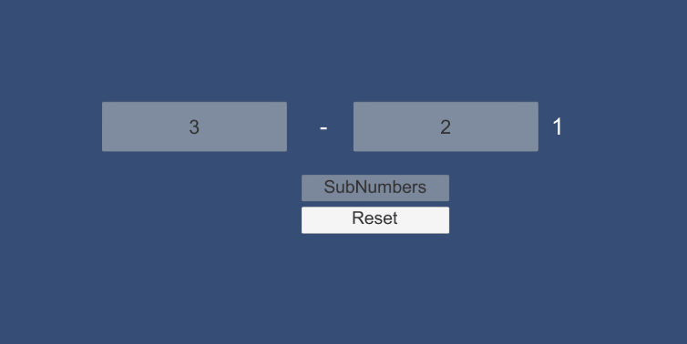
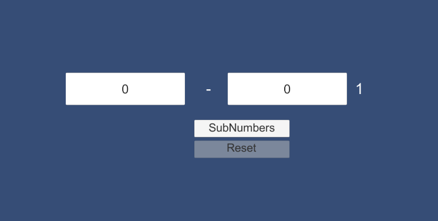

# Unity2019114f1-2D-Template

### Project description: 
2 input Fields which subtract the second from the firsr number and show the result

### Development platform: 
macOS High Sierra, Unity 2019.1.14f, Visual Studio Code 2019

### Target platform: 
WebGL (refRes: 1280x720 HD-720p)

### Visuals: 

### Third party material: 
Unityproject Template: (Link: https://github.com/3ahmnm-htlsbg/Unity2019114f1-2D-Template)

### Project state: 
fin.

### Lessons Learned: 
-create GUI
-add and edit Buttons and InputFields

Copyright by lhell