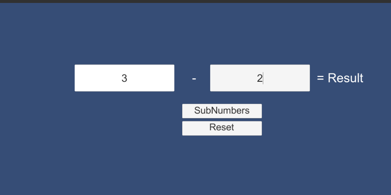

# Unity2019114f1-2D-Template

### Project description: 
<<<<<<< HEAD
2 input Fields which subtract the second from the firsr number and show the result

### Development platform: 
macOS High Sierra, Unity 2019.1.14f, Visual Studio Code 2019
=======
Two Input Fields which can subtract numbers. After subtracting the numbers, a result is displayed.

### Development platform: 
macOS High Sierra, Unity version 2019.1.14f1, Visual Studio Code 2019
>>>>>>> 34cca2190979773d723940ec3b6740a4a627472f

### Target platform: 
WebGL (refRes: 1280x720 HD-720p)

### Visuals: 
<<<<<<< HEAD

=======
>>>>>>> 34cca2190979773d723940ec3b6740a4a627472f

### Third party material: 
Unityproject Template: (Link: https://github.com/3ahmnm-htlsbg/Unity2019114f1-2D-Template)

### Project state: 
<<<<<<< HEAD
fin.

### Lessons Learned: 
-create GUI
-add and edit Buttons and InputFields

Copyright by lhell
=======
finished

### Lessons Learned: 
- create ref resolution in Unity
- create a GUI with inputfield and buttons
- add C# Script
- edit buttons

Copyright by lhell
>>>>>>> 34cca2190979773d723940ec3b6740a4a627472f
